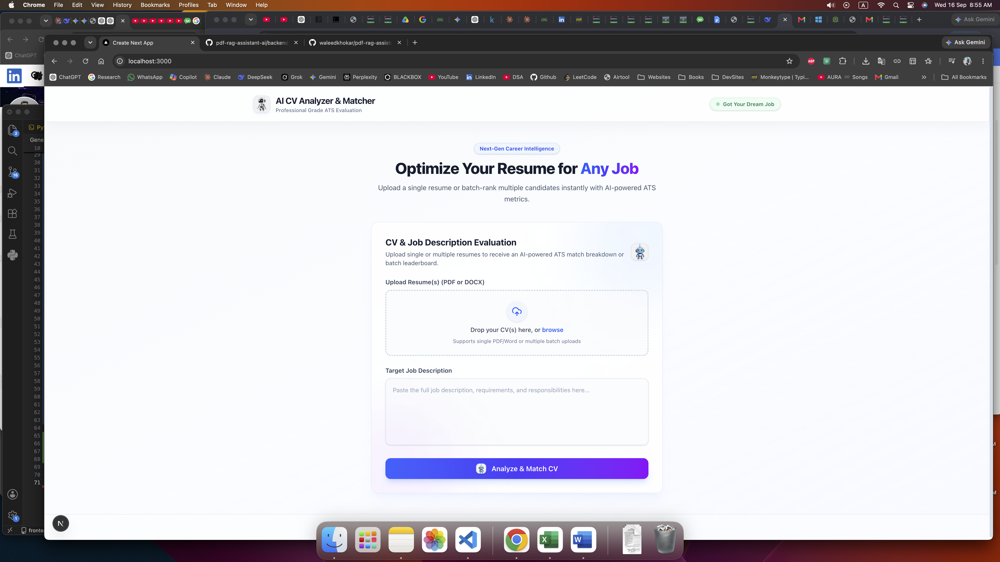
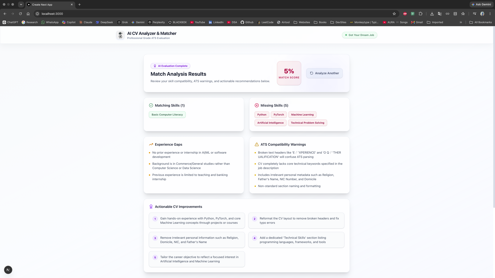
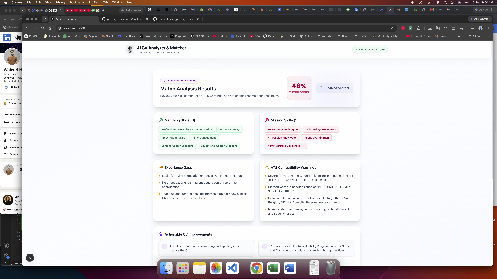
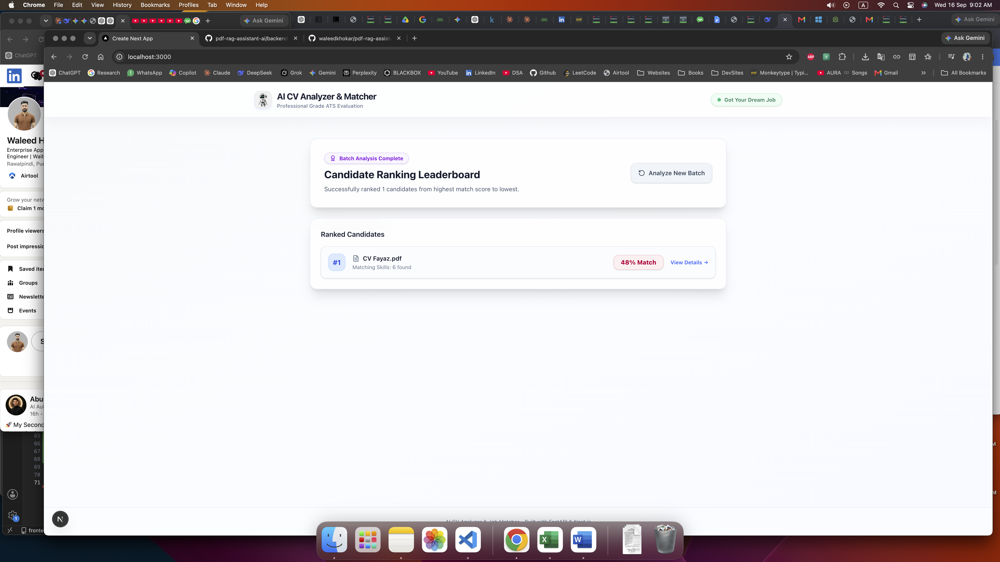

# 📄 AI CV Analyzer & Matcher | Intelligent ATS & Batch Ranking Platform

**AI CV Analyzer & Matcher** is a full-stack, AI-powered recruitment intelligence platform. It bridges the gap between candidates and recruiters by providing deep, real-time resume evaluations, ATS-optimized breakdown reports, and automated batch ranking for hiring workflows.

---

## 🚀 Project Overview

Transforming traditional hiring processes, this application evaluates resumes against target job descriptions using **Google Gemini Flash** and advanced text parsing. Built with a robust **FastAPI** backend and a high-performance **Next.js** frontend styled with a modern **light glassmorphism** aesthetic, it supports both individual career optimization and bulk multi-candidate leaderboard rankings.

---

## ✨ Core Features

* 📄 **Single & Batch Resume Processing**: Upload a single CV for an exhaustive breakdown or drop multiple resumes (up to 15 at once) to instantly generate a ranked HR leaderboard.
* ⚡ **Automatic 503 & Rate-Limit Resilience**: Built-in exponential backoff retry mechanisms and paced processing ensure high traffic spikes or server overloads never crash your session.
* 🎯 **Deep ATS Scoring & Gap Analysis**: Calculates precise matching scores alongside categorized insights: matching skills, missing critical keywords, experience gaps, and potential ATS layout formatting errors.
* 💡 **Actionable Recommendations & Interview Prep**: Generates tailored bullet points for resume enhancement and targeted technical/behavioral interview questions for recruiters.
* 🎨 **Clean Light Glassmorphism UI**: Modern translucent surfaces, custom branding assets (`logo.jpeg`, `sendbutton.jpeg`), ambient glowing backdrops, and seamless responsive design.

---

## 📸 Screenshots

| Workspace & Upload View | Batch Ranking Leaderboard |
| :---: | :---: |
|  |  |

| Detailed Analysis Breakdown | ATS Gap & Improvement Insights |
| :---: | :---: |
|  |  |

## 🛠 Tech Stack

### Frontend
<div align="left">
  
  
  
  
  
</div>
<p>Built with Next.js, TypeScript, and Tailwind CSS, featuring glassmorphism styles, responsive grid layouts, and asynchronous multipart form handling.</p>

---

### Backend, AI & LLM Core
<div align="left">
  
  
  
  
  
  
  
</div>
<p>Powered by Python, FastAPI, strict Pydantic validation schemas, Google Gemini Flash API (<code>gemini-3.6-flash</code>), LangChain frameworks, RAG parsing pipelines, and Agentic AI workflows for deep resume intelligence.</p>

---


## 📁 Project Structure

```text
ai-cv-analyzer-matcher/
├── frontend/                   # Next.js Application
│   ├── public/                 # Static assets & UI branding (logo.jpeg, sendbutton.jpeg)
│   ├── src/
│   │   ├── app/
│   │   │   ├── layout.tsx      # Root application layout
│   │   │   └── page.tsx        # Main workspace & evaluation dashboard
│   │   ├── components/
│   │   │   └── CVUploadForm.tsx# Multi-file dropzone & submission handler
│   │   └── types/
│   │       └── analysis.ts     # TypeScript interfaces for CV responses
│   ├── package.json
│   └── tailwind.config.js
│
├── backend/                    # FastAPI & AI Engine
│   ├── app/
│   │   ├── routers/            # API endpoints (single /analyze & batch /analyze-batch)
│   │   ├── schemas/            # Pydantic data validation schemas
│   │   ├── services/           # Gemini AI integration & text parser utilities
│   │   └── config.py           # Core settings & environment configurations
│   ├── main.py                 # FastAPI application entry point & middleware setup
│   └── requirements.txt        # Python backend dependencies
│
└── README.md

```

---

## 🚀 Quick Start & Installation

Follow these simple steps to run the project locally on your system.

### Prerequisites

* **Node.js** (v18.x or higher)
* **Python** (v3.10 or higher)
* **Git**

---

### 1️⃣ Clone the Repository

```bash
git clone https://github.com/waleedkhokar/ai-cv-analyzer-matcher.git
cd ai-cv-analyzer-matcher

```

---

### 2️⃣ Frontend Setup

```bash
# Navigate to frontend directory
cd frontend

# Install dependencies
npm install

# Set up local environment variables
echo "NEXT_PUBLIC_API_URL=http://127.0.0.1:8000/api/v1" > .env.local

# Run Next.js development server
npm run dev

```

The frontend will run locally at `http://localhost:3000`.

---

### 3️⃣ Backend Setup

```bash
# Navigate to backend directory
cd ../backend

# Create a virtual environment
python -m venv venv
source venv/bin/activate  # On Windows: venv\Scripts\activate

# Install dependencies
pip install -r requirements.txt

# Set up your environment variables
echo "GEMINI_API_KEY=your_google_gemini_api_key_here" > .env

# Start FastAPI server
uvicorn main:app --reload

```

The backend server will run at `[http://127.0.0.1:8000](http://127.0.0.1:8000)`.

---

## 👨‍💻 Developer

**Waleed Khokhar**

*Full-Stack Developer (Web + App) & AI Engineer*

Full-Stack Developer with 1+ year of experience building scalable web apps (Next.js, Node.js, FastAPI), cross-platform mobile apps (React Native), and intelligent AI solutions (Agentic AI, LLM, RAG, LangChain). Currently serving as Enterprise Application Developer, delivering production-ready software and enterprise solutions.

🌐 **Portfolio:** [waledkhokar.vercel.app](https://www.google.com/search?q=https://waledkhokar.vercel.app/)

💼 **LinkedIn:** [linkedin.com/in/waleedkhokhar](https://www.google.com/search?q=https://www.google.com/search?q=linkedin.com/in/waleedkhokhar)

💻 **GitHub:** [github.com/waleedkhokar](https://www.google.com/search?q=https://www.google.com/search?q=github.com/waleedkhokar)

---

## 📄 License

Currently a personal development and portfolio project. License terms to be defined prior to commercial deployment.

---

⭐ **If this project inspired your recruitment workflow design, consider starring the repo!**