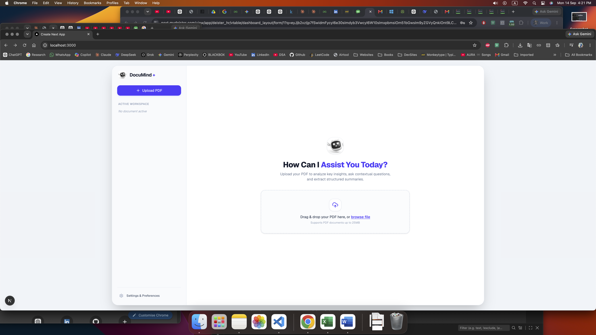
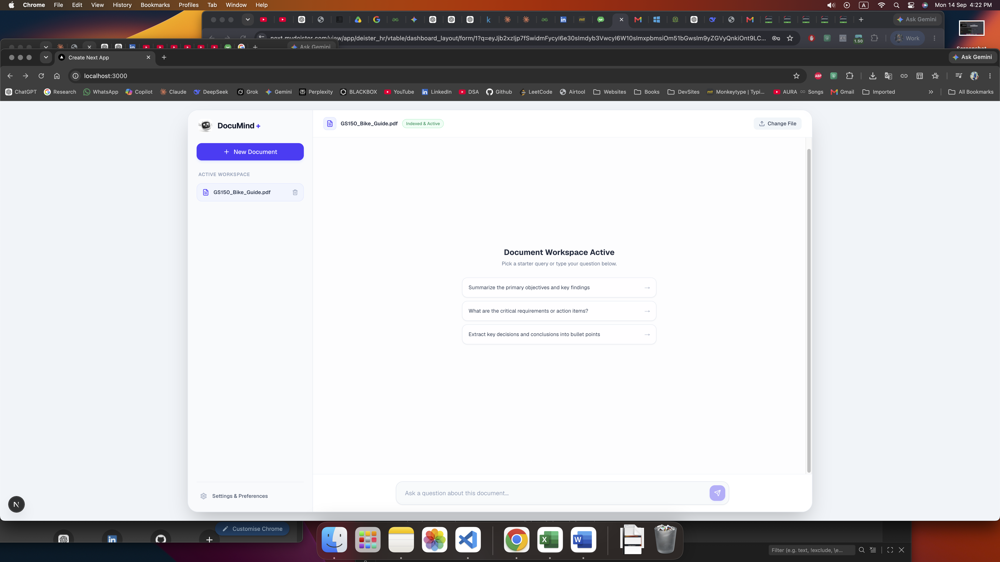
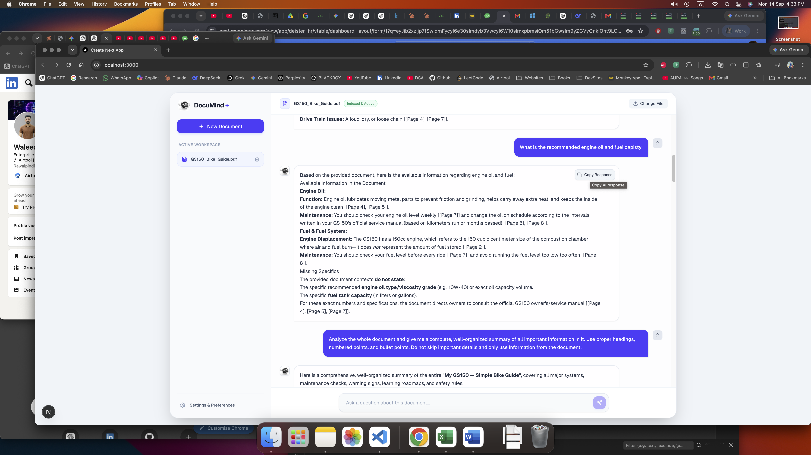
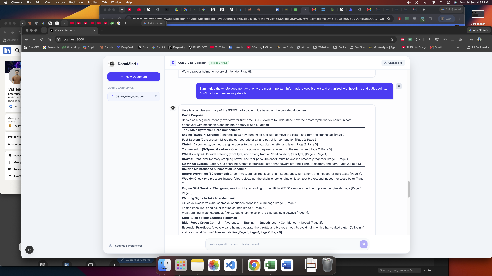

# 📄 DocuMind+ | Intelligent PDF Chatbot

DocuMind+ is a full-stack, AI-powered document analysis platform. It allows users to upload PDF documents, automatically index their content using vector search, and chat directly with their files in real time using a streaming AI assistant.

---

## 🚀 Project Overview

DocuMind+ transforms static PDF documents into interactive knowledge bases. Built with Next.js on the frontend and FastAPI on the backend, the application features a Retrieval-Augmented Generation (RAG) pipeline that provides precise, context-aware answers with minimal latency.

---

## ✨ Core Features

* 📄 **Seamless PDF Upload**: Drag-and-drop or browse PDF documents up to 25MB for instant indexing.
* ⚡ **Real-Time Streaming Responses**: Get AI-generated answers streamed directly to your interface token-by-token.
* 🎯 **Contextual Document Search**: Utilizes vector embeddings to search and pull relevant sections from your files.
* 📋 **One-Click Response Copy**: Quickly copy formatted markdown responses directly from any AI message bubble.
* 🎨 **Modern & Responsive UI**: Clean canvas interface with a sticky left sidebar, custom branding, and interactive starter prompts.

---

## 📸 Screenshots

| Home Page | PDF Upload View |
| :---: | :---: |
|  |  |

| AI Chat Streaming | Search & Analytics |
| :---: | :---: |
|  |  |

---

## 🛠 Tech Stack

### Frontend
  

Built with Next.js, TypeScript, and Tailwind CSS for a modern, fast, and fully responsive user interface.

### Backend
    

Powered by Python, FastAPI, LangChain, RAG architecture, LLMs (OpenAI API), Vector Databases (ChromaDB / FAISS), and PyPDF for document parsing, embedding generation, and real-time streaming responses.

---

## 📁 Project Structure

```text
documind-plus/
├── frontend/                   # Next.js Application
│   ├── public/                 # Static assets & screenshots (logo.jpeg, 1.png, 2.png, 3.png, 4.png)
│   ├── src/
│   │   ├── app/
│   │   │   ├── layout.tsx      # Root application layout
│   │   │   └── page.tsx        # Main workspace & upload view
│   │   └── components/
│   │       └── ChatBox.tsx     # Interactive chat interface & response streaming
│   ├── package.json
│   └── tailwind.config.js
│
├── backend/                    # FastAPI & AI Pipeline
│   ├── app/
│   │   ├── api/                # API routes (upload & streaming chat endpoints)
│   │   ├── core/               # Configuration settings & environment setup
│   │   ├── services/           # RAG pipeline, LangChain processing & LLM logic
│   │   └── utils/              # PDF loaders & text chunking utilities
│   ├── vector_store/           # Persisted vector database index files
│   ├── main.py                 # FastAPI application entry point
│   └── requirements.txt        # Python backend dependencies
│
└── README.md

```


## 🚀 Quick Start & Installation

Follow these simple steps to run the project locally on your system.

### Prerequisites

* **Node.js** (v18.x or higher)
* **Python** (v3.10 or higher)
* **Git**

---

### 1️⃣ Clone the Repository

```bash
git clone [https://github.com/waleedkhokar/pdf-rag-assistant.git](https://github.com/waleedkhokar/pdf-rag-assistant.git)
cd documind-plus

```

---

### 2️⃣ Frontend Setup

```bash
# Navigate to frontend directory
cd frontend

# Install dependencies
npm install

# Set up local environment variables
echo "NEXT_PUBLIC_API_URL=[http://127.0.0.1:8000](http://127.0.0.1:8000)" > .env.local

# Run Next.js development server
npm run dev

```

The frontend will run locally at `http://localhost:3000`.

---

### 3️⃣ Backend Setup

```bash
# Navigate to backend directory
cd ../backend

# Create a virtual environment
python -m venv venv
source venv/bin/activate  # On Windows: venv\Scripts\activate

# Install dependencies
pip install -r requirements.txt

# Add your environment key
echo "OPENAI_API_KEY=your_openai_api_key_here" > .env

# Start FastAPI server
uvicorn main:app --reload

```

The backend server will run at `http://127.0.0.1:8000`.

---

## 👨‍💻 Developer

**Waleed Khokhar**

*Full-Stack Developer (Web + App) & AI Engineer*

Full-Stack Developer with 1+ year of experience building scalable web apps (Next.js, Node.js, FastAPI), cross-platform mobile apps (React Native), and intelligent AI solutions (Agentic AI, LLM, RAG, LangChain). Currently serving as Enterprise Application Developer, delivering production-ready software and enterprise solutions.

🌐 **Portfolio:** [waledkhokar.vercel.app](https://www.google.com/search?q=https://waledkhokar.vercel.app/)

💼 **LinkedIn:** [linkedin.com/in/waleedkhokhar](https://www.google.com/search?q=https://linkedin.com/in/waleedkhokhar)

💻 **GitHub:** [github.com/waleedkhokar](https://www.google.com/search?q=https://github.com/waleedkhokar)

---

## 📄 License

Currently a personal/private development project. License terms to be added before public production release.

---

⭐ **If this project helped you understand real-world RAG workflow design, consider starring the repo!**