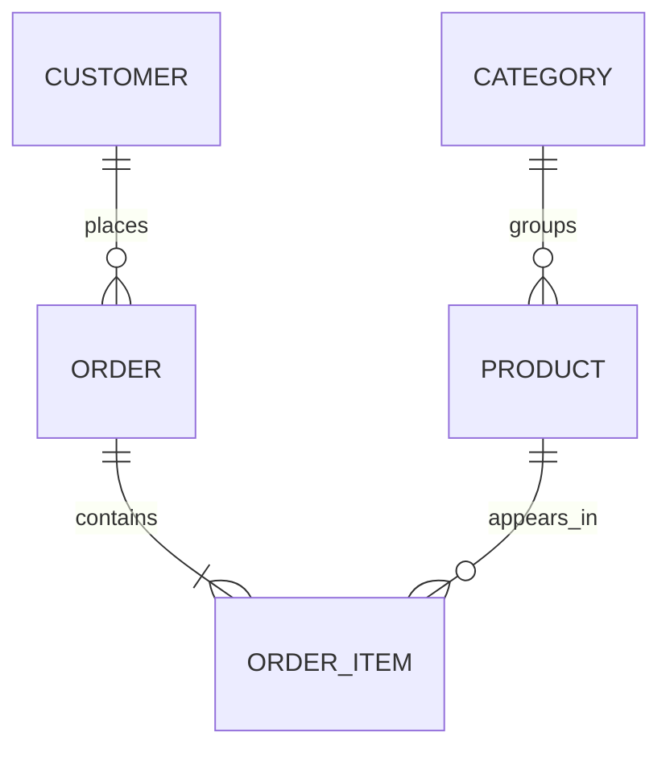

# 10 — Database Design

## 🎯 Goals
- Move from writing queries to designing databases
- Model with ER diagrams
- Normalize and denormalize deliberately
- Enforce integrity with keys and constraints

## 📚 Topics
1. Design process
2. ER modeling
3. Keys and ID strategies
4. Normalization (1NF–BCNF, 4NF, 5NF)
5. Denormalization
6. Referential integrity
7. Common design patterns
8. Anti-patterns

---

## 1. Design Process

```text
Requirements → Entities → Attributes → Relationships → ER Diagram
→ Keys → Constraints → Normalization → Indexes → Implementation
```

## 2. ER Modeling

```text
Customer ──1:N──> Order ──1:N──> OrderItem ──N:1──> Product
```

Learn: entity, attribute, relationship, cardinality, optionality, weak entity.



## 3. ID Strategies

| Strategy | Pros | Cons |
|----------|------|------|
| `BIGSERIAL` / `IDENTITY` | Compact, ordered | Guessable, hard to merge across systems |
| `UUID` (v4) | Globally unique | Larger, random → index fragmentation |
| `UUIDv7` / `ULID` | Unique + time-sortable | Newer support |
| Natural key | Meaningful | Can change |

```sql
id BIGINT GENERATED ALWAYS AS IDENTITY PRIMARY KEY
```

## 4. Normalization

| Form | Rule |
|------|------|
| **1NF** | Atomic values, no repeating groups |
| **2NF** | 1NF + no partial dependency on part of a composite key |
| **3NF** | 2NF + no transitive dependencies |
| **BCNF** | Every determinant is a candidate key |
| **4NF** | No multi-valued dependencies |
| **5NF** | No join dependencies |

Example — unnormalized:

```text
orders(id, customer_name, customer_email, product1, product2, product3)
```

Normalized:

```text
customers(id, name, email)
orders(id, customer_id, order_date)
order_items(order_id, product_id, quantity, unit_price)
products(id, name, price)
```

Purpose: reduce redundancy, avoid update/insert/delete anomalies, protect integrity.

## 5. Denormalization

Intentional redundancy for read performance, reporting, or fewer joins.

Examples: storing `order_total` on `orders`, snapshotting `unit_price` in `order_items` (correct — price history!), summary tables, materialized views.

Cost: you must keep copies consistent (triggers, jobs, application logic).

## 6. Referential Integrity

```sql
FOREIGN KEY (customer_id) REFERENCES customers(id)
    ON DELETE RESTRICT
    ON UPDATE CASCADE
```

| Action | Effect on child rows |
|--------|----------------------|
| `RESTRICT` / `NO ACTION` | Block the delete |
| `CASCADE` | Delete/update children too |
| `SET NULL` | Set FK to NULL |
| `SET DEFAULT` | Set FK to default |

## 7. Constraint Toolbox

```text
PRIMARY KEY, FOREIGN KEY, UNIQUE, NOT NULL, CHECK, DEFAULT, EXCLUDE
```

Constraints are part of the **integrity model**, not just validation. Prefer enforcing rules in the database over relying solely on application code.

## 8. Common Patterns

- **Junction table** for many-to-many
- **Soft delete** (`deleted_at`) — needs partial unique indexes
- **Audit columns** (`created_at`, `updated_at`, `created_by`)
- **Status via lookup table or CHECK/ENUM**
- **Polymorphic association** — prefer separate FKs or a supertype table
- **Slowly changing dimensions** (see module 12)
- **Multi-tenancy:** shared schema + `tenant_id`, schema per tenant, DB per tenant

## 9. Anti-patterns

- Storing comma-separated lists in a column
- EAV (entity–attribute–value) everywhere
- Missing foreign keys
- `FLOAT` for money
- Overusing `NULL` / meaning-laden magic values
- One giant table for everything
- Premature denormalization

---

## ✅ Practice
1. Design a library system (books, authors, members, loans).
2. Design an e-commerce schema with addresses and payments.
3. Normalize a messy spreadsheet to 3NF.
4. Draw the ERD with Mermaid or dbdiagram.io.
5. Implement it in PostgreSQL with constraints and indexes.

## 🧠 Self-check
- Why snapshot `unit_price` in `order_items`?
- 3NF vs BCNF?
- When is `ON DELETE CASCADE` dangerous?

## 📓 Notebook
[class35.ipynb](./class35.ipynb)
